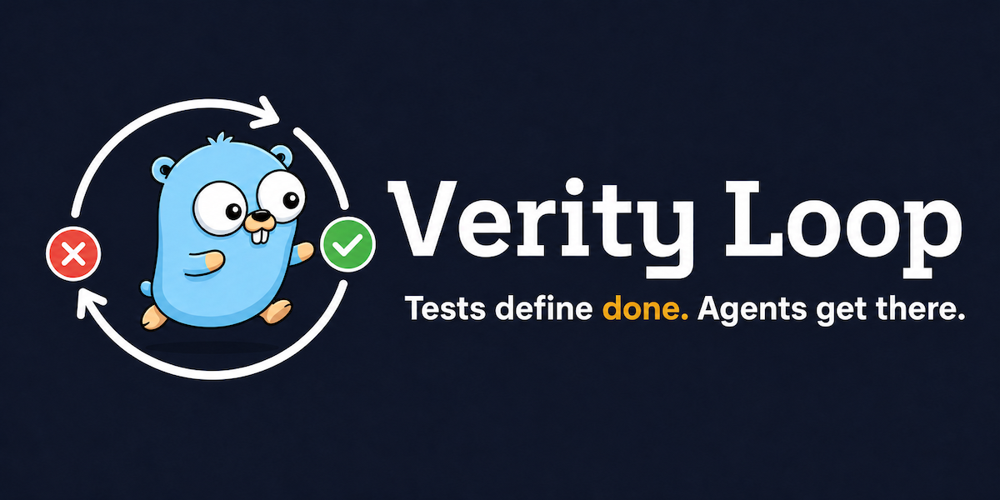

# Verity Loop

A CLI tool that drives an LLM agent to fix a failing Go acceptance test. It starts your services, runs the test, feeds failures to the agent, and iterates until the test goes green — or gives up after a configurable number of attempts.



## How it works

1. **Init** — takes a baseline git snapshot of each service's working tree, starts all configured services in order, and waits for their liveness endpoints
2. **Preliminary check** — runs the test immediately; exits 0 if it already passes
3. **Loop** — on each iteration: builds a prompt (iteration 1: user prompt + test output; iteration 2+: test output + git diff vs baseline), calls the agent, restarts services, re-runs the test; repeats until green or max iterations exhausted
4. **Rollback** — if service liveness fails after an agent run, the working tree is restored to its pre-agent state and the next prompt describes what broke
5. **Teardown** — stops all services in reverse order on success, failure, or interrupt

The agent is any binary that accepts a prompt as its last positional argument and exits when done. Changes land on disk; git operations are up to you.

## Install

**Requires Go 1.22+.**

```sh
go install github.com/verity-bdd/verity-loop/cmd/verity-loop@latest
```

**Or build from source:**

```sh
git clone https://github.com/verity-bdd/verity-loop
cd verity-loop
go build -o verity-loop ./cmd/verity-loop
```

## Usage

```sh
verity-loop run [--config <path>]
```

Run this from any directory that contains a `verity.yaml`. The harness reads its config, starts services, and begins the loop. Pass `--config` to point at a `verity.yaml` in a different location.

## Configuration (`verity.yaml`)

```yaml
agent:
  command: "claude"           # agent binary
  args: ["--dangerously-skip-permissions", "-p"]
  timeout: 10m                # per-iteration timeout (default: 10m)

max_iterations: 10

prompt_file: "./PROMPT.md"   # base prompt shown to the agent on iteration 1

test_command: "go test ./... -run TestMyFeature -v"

context:
  max_diff_lines: 200         # truncation limit for git diff in the prompt
  max_test_output_lines: 100  # truncation limit for test output in the prompt

services:
  - name: my-service
    start:   "make run"
    stop:    "make stop"
    restart: "make restart"
    work_dir: "./my-service"    # defaults to the directory of verity.yaml
    env:
      DATABASE_URL: "postgres://localhost/mydb"
    liveness:
      url:      "http://localhost:8080/health"
      timeout:  30s
      interval: 1s
```

**Services** are started in list order and stopped in reverse. Omit `liveness` to skip health polling for a service. The harness takes a git snapshot of each service's `work_dir` at startup and uses it to compute diffs for the agent prompt and to roll back changes when a service fails to restart.

**Agent contract:** the harness calls `<command> <args...> <prompt>` — the prompt string is always the last positional argument.

## Example

The `examples/hello-world/` directory shows a minimal setup: a failing `Greet` function, a test, and a `verity.yaml` that uses `claude` as the agent.

```sh
cd examples/hello-world
verity-loop run
```

The agent receives the failing test output, edits `greeter.go`, and the harness re-runs the test until it passes.

## Exit codes

| Code | Meaning |
|------|---------|
| `0`  | Test passed |
| `1`  | Max iterations exhausted, service startup failed, or 3 consecutive agent timeouts |

On failure the harness prints the last iteration number and test output. Any file changes made by the agent remain on disk.

## Signals

`SIGINT` / `SIGTERM` trigger a clean teardown (services stopped in reverse order) and exit 1.
